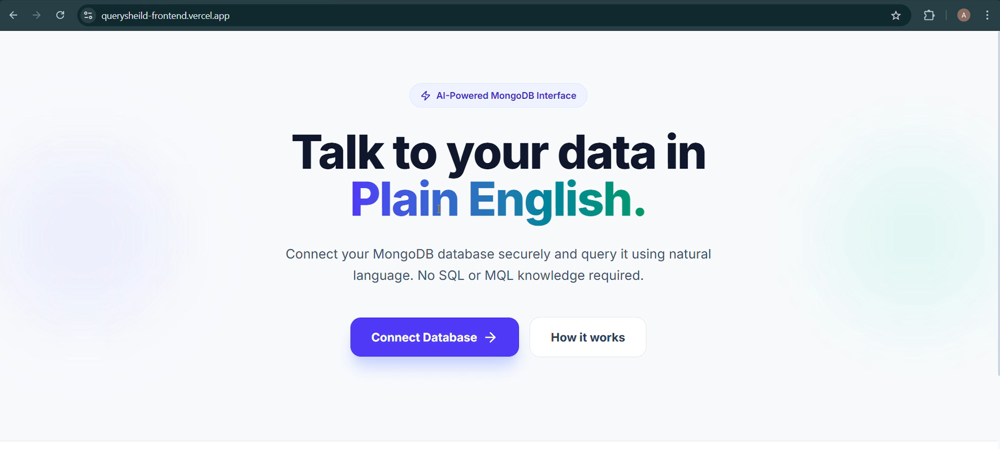
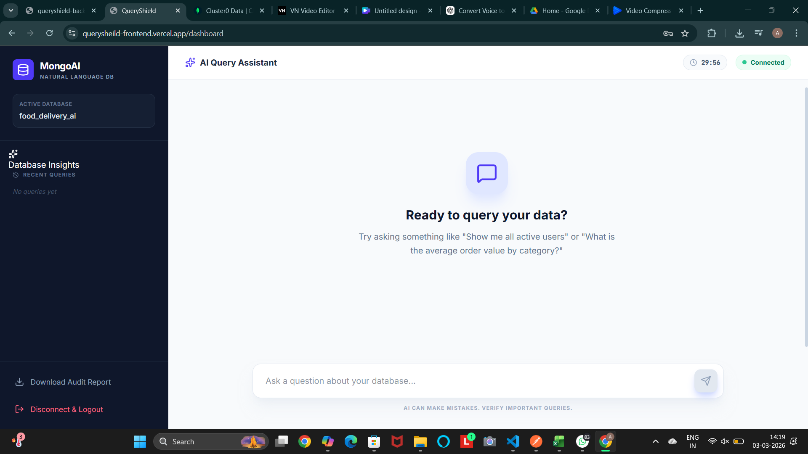
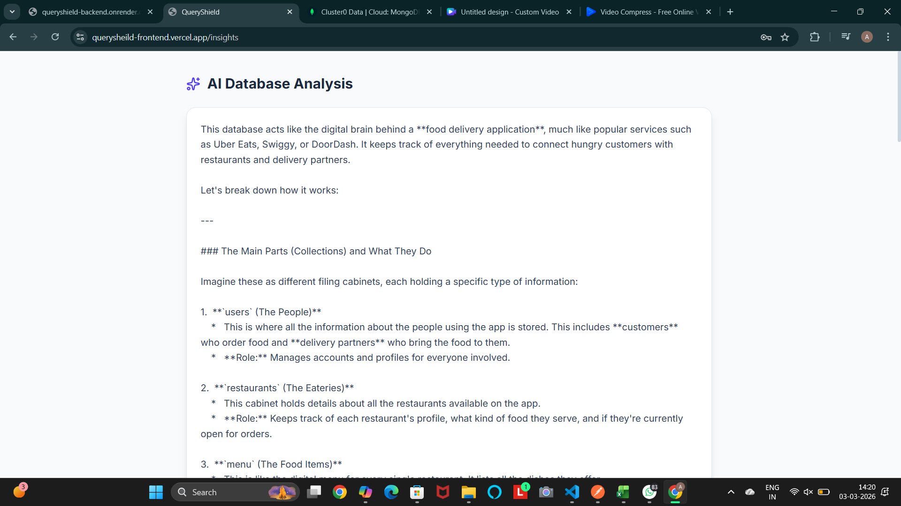
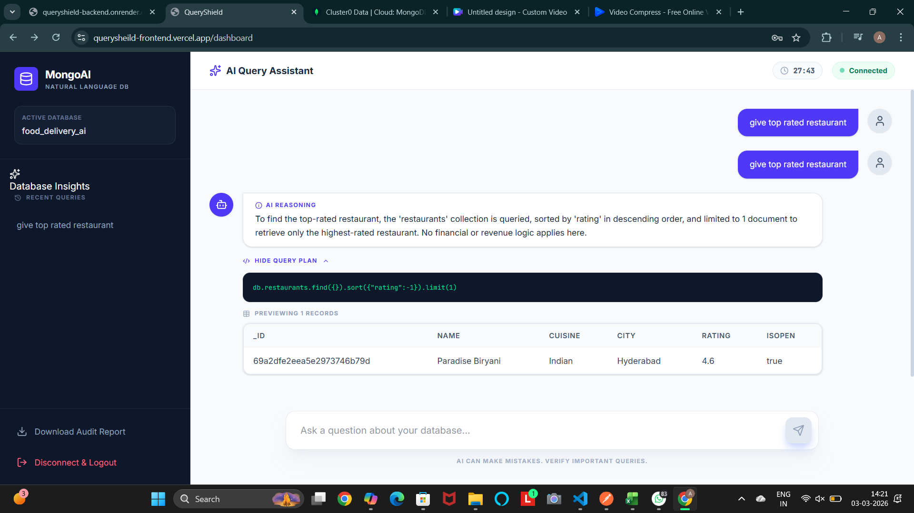

# 🛡️ QueryShield

### Secure Natural Language Interface for MongoDB
**Making databases accessible — without making them vulnerable.**

[](https://opensource.org/licenses/MIT)
[](https://www.mongodb.com/atlas)
[](https://nodejs.org/)
[](https://reactjs.org/)

---

## 🚩 The Problem
Modern databases are powerful but inaccessible to non-technical stakeholders. To retrieve data, a user usually needs to master MongoDB syntax or rely on a developer. Furthermore, granting direct database access poses massive security risks, including accidental deletions or data corruption.

**QueryShield** bridges this gap by providing a secure, AI-powered interface that converts plain English into verified, read-only MongoDB queries.

## 💡 Key Features
- **Natural Language Querying:** Ask questions like *"Who are the top 5 customers by revenue?"*
- **Safety-First AI:** Built-in validation that blocks any `write`, `update`, or `delete` operations.
- **Auto-Schema Discovery:** Automatically scans collections and detects relationships (ObjectIds, references) without storing your private data.
- **Session Isolation:** Database connections exist only in server memory and auto-expire after 1 hour of inactivity.
- **Read-Only Enforcement:** Rejects any connection string that has more than `readAnyDatabase` permissions.

## 🧠 How It Works
1. **Schema Mapping:** The backend extracts the database structure.
2. **AI Translation:** An LLM (Groq/Gemini) generates a structured JSON query plan.
3. **Strict Validation:** The server verifies the plan against a whitelist of allowed MongoDB operators.
4. **Safe Execution:** The query runs, and results are returned in a clean, tabular UI.
5. **Dynamic export:** Downloadable csv files with user english queries and llm generated mongodb queries

---

## 🛠️ Tech Stack
| Layer | Technology |
| :--- | :--- |
| **Frontend** | React, TypeScript, TailwindCSS, Framer Motion |
| **Backend** | Node.js, Express.js, MongoDB Driver |
| **AI/LLM** | Groq / Gemini (Schema-grounded prompting) |
| **Infrastructure** | MongoDB Atlas |

---

## ScreenShots
### 🏠 Landing Page


### 🔗 Database Connection Page


### 📊 Dashboard Interface


### 🤖 AI Insights


### AI Query in Action


## 🌐 Live Deployment

| Service | Platform | URL |
| :--- | :--- | :--- |
| **Frontend UI** | Vercel | [https://your-frontend-link.vercel.app](https://querysheild-frontend.vercel.app/) |
| **Backend API** | Render | [https://your-backend-link.onrender.com](https://queryshield-backend.onrender.com/) |

---

## 🚀 Getting Started

### 1. Prerequisites
- Node.js (v18+)
- MongoDB Atlas account
- Groq or Google Gemini API Key
### 🔐 Environment Variables
**Backend (`backend/.env`)**
```env
GEMINI_API_KEY=your_gemini_api_key
SESSION_SECRET=a_very_long_random_string
PORT=5000
FRONTEND_URL=http://localhost:3000
```
**Frontend (`frontend/.env`)**
```env
VITE_API_URL=your_backend_url
```
### 2. Installation
```bash
# Clone the repository
git clone [https://github.com/your-username/queryshield.git](https://github.com/your-username/queryshield.git)
cd queryshield

# Setup Backend
cd backend
npm install
# Create a .env file with your API keys (see .env.example)
node server.js

# Setup Frontend
cd frontend
npm install
npm run dev


